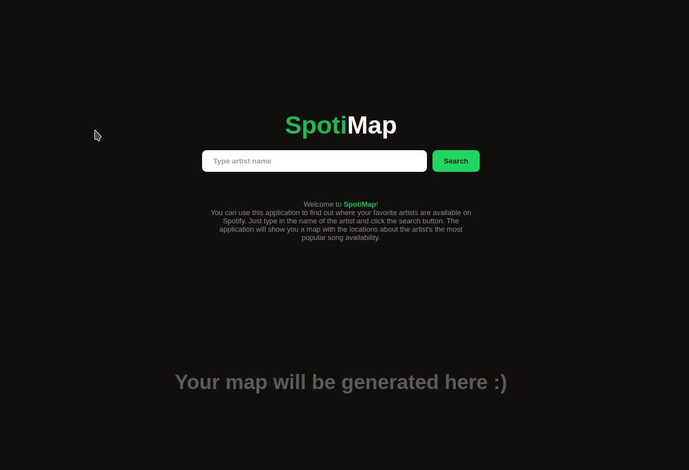

# SpotiMap

Lab 2. Web application for PB(UCU).

You can use this application to find out where your favorite artists are available on Spotify.\
Just type in the name of the artist and click the search button. The application will show you a map with the locations about the artist's the most popular song availability.


# Project Description

Project is based on the Spotify API and Flask framework.\
The application is deployed on [PythonAnywhere](https://pythonanywhere.com/).


## Structure
```
.
├── app.py
├── countries.csv
├── LICENSE
├── map_creator.py
├── README.md
├── requirements.txt
├── screenshots
│   ├── screenshot1.png
│   └── screenshot2.png
├── spotify_api.py
├── static
│   ├── custom.js
│   └── style.css
└── templates
    ├── index.html
    └── map-placeholder.html
```


### Main files

```app.py``` - main file with Flask application.

```spotify_api.py``` - module to work with Spotify API.

```map_creator.py``` - module uses Foilum to create maps.

---
Also you can see there is a file ```countries.csv``` - database with countries codes and locations.


# Getting Started

Open link https://mvysotskyi.pythonanywhere.com/ and enjoy!


# Screeenshots




# License

This project is licensed under the MIT License - see the [LICENSE](LICENSE) file for details.